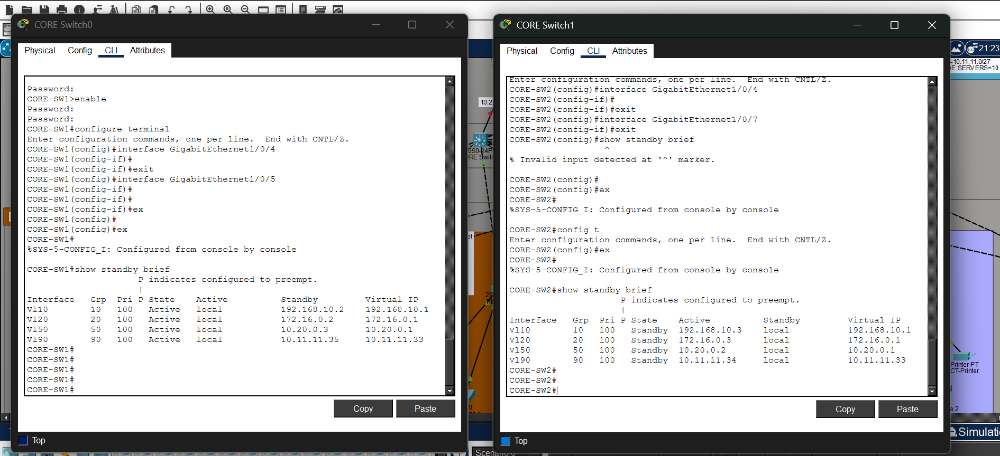

# Lab 05 - Secure Company Network

A Cisco Packet Tracer design for a segmented company network with redundant core services, wireless access, server networks, and controlled administration.

## Project Files

- `Secure-company-network.pkt` - Packet Tracer project
- `HRSP.png` - HSRP status captured from the core switches
- `Screenshot 2026-09-24 082316.png` and `Screenshot 2026-09-24 082625.png` - addressing plan and technical requirements

## Network Scope

The lab covers a hierarchical network design with two ISP connections, a Cisco ASA firewall, multilayer core switches, access switches, wireless LAN controllers, access points, and a server farm.

The documented design includes:

- VLAN segmentation for management, user LAN, WLAN, and VoIP traffic
- VLAN 199 as a blackhole VLAN for unused switch ports
- Inter-VLAN routing on multilayer switches and OSPF route exchange
- HSRP virtual gateways for core-switch redundancy
- DHCP services with relay on client VLANs
- LACP EtherChannel and spanning-tree protections, including PortFast and BPDU Guard
- SSH-only remote administration with an access control list
- Firewall policies and voice gateway configuration

## VLAN Plan

| VLAN | Purpose |
|------|---------|
| 10 | Management |
| 20 | User LAN |
| 50 | WLAN |
| 70 | VoIP |
| 199 | Unused ports (blackhole) |

## HSRP Verification

The captured switch output shows CORE-SW1 active and CORE-SW2 standby for the displayed VLAN interfaces, with shared virtual gateway addresses.



Useful Packet Tracer CLI checks include:

```text
show standby brief
show vlan brief
show interfaces trunk
show etherchannel summary
show ip route
show ip interface brief
```

## Tools

- Cisco Packet Tracer
- Cisco IOS CLI