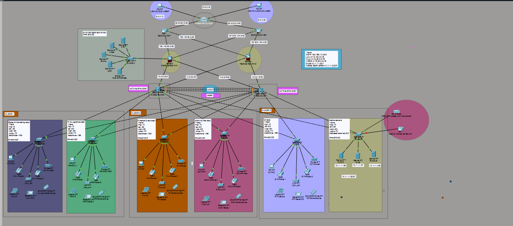
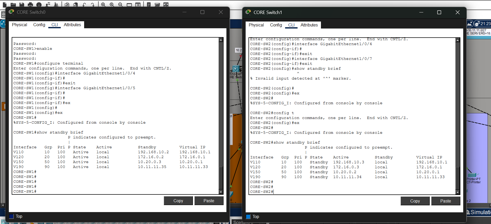

# Lab 05: Secure Company Network

A Cisco Packet Tracer project for a segmented company network with redundant core services, wireless access, server networks, and controlled administration.

## Project Overview

The design uses a hierarchical network with two ISP connections, a Cisco ASA firewall, multilayer core switches, access switches, wireless LAN controllers, access points, and a server farm. The project focuses on network segmentation, availability, secure administration, and connectivity between departments.

## Topology



See [Network Design](documentation/network-design.md) for the design details and items to be completed.

## VLAN Summary

| VLAN | Purpose |
|------|---------|
| 10 | Management |
| 20 | User LAN |
| 50 | WLAN |
| 70 | VoIP |
| 199 | Unused ports (blackhole) |

The full subnet and gateway plan will be documented in the [Addressing Table](documentation/addressing-table.md).

## Design and Security

The documented implementation includes inter-VLAN routing, OSPF route exchange, HSRP virtual gateways, DHCP relay for client VLANs, LACP EtherChannel, and spanning-tree protections such as PortFast and BPDU Guard. Administrative access is intended to use SSH with an access control list; firewall policies and voice gateway configuration are also part of the scope.

Detailed requirements are available in [Technical Requirements](screenshots/technical-requirements.png). Device configuration exports will be organized in [`configurations/`](configurations/).

## Verification

The HSRP capture shows CORE-SW1 active and CORE-SW2 standby for the displayed VLAN interfaces, using shared virtual gateway addresses.



Useful Packet Tracer CLI checks:

```text
show standby brief
show vlan brief
show interfaces trunk
show etherchannel summary
show ip route
show ip interface brief
```

## Project Files

- `Secure-company-network.pkt` - Cisco Packet Tracer project
- [`screenshots/`](screenshots/) - Topology and verification evidence
- [`documentation/`](documentation/) - Design notes and addressing plan
- [`configurations/`](configurations/) - Device configuration exports

## Tools

- Cisco Packet Tracer
- Cisco IOS CLI